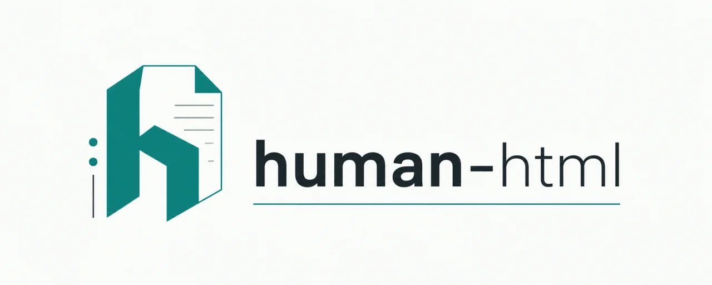

<p align="center">
  
</p>

# human-html

[](https://skills.sh/rhnfzl/human-html)
[](https://github.com/rhnfzl/human-html/releases)
[](LICENSE)


Make the next document a teammate actually reads.

An Agent Skill for the documents agents produce for humans: plans, reviews, architecture explainers, research, decisions, prototypes, status reports, postmortems. Each one lands as a single self-contained HTML page (plain-language summary, a diagram in every comparison, color-coded risks) instead of a Markdown wall that gets skimmed and rubber-stamped. An offline validator enforces that shape as a contract. See the [live gallery](https://rhnfzl.github.io/human-html/) of all nine kinds.

## Quickstart (30 seconds)

One command, and it auto-detects your installed agents; that is the whole setup:

```bash
npx skills add rhnfzl/human-html
```

Then ask your agent for a plan, review, or postmortem. The agent scaffolds, validates, and indexes everything; the `docs/human-html/` lane appears in a workspace with the first artifact.

Enable the optional advisory and autoindex hooks globally for Claude Code, Codex, Cursor, and Windsurf:

```bash
python3 <skill-dir>/activate_hooks.py
```

The command merges with existing settings and is safe to rerun. Replace `<skill-dir>` with the installed skill path shown by your installer, commonly `~/.agents/skills/human-html`.

<details>
<summary>Other install routes and manual use</summary>

- `npx openskills install rhnfzl/human-html` (AGENTS.md ecosystems)
- Claude Code natively: `/plugin marketplace add rhnfzl/human-html`, then `/plugin install human-html@rhnfzl`
- Manual: clone this repo and symlink `skills/human-html/` into your agent's skills directory
- Drive the CLI yourself: `python3 <skill-dir>/human_html_artifacts.py new|check|index`, where `<skill-dir>` is wherever the installer put the skill (e.g. `~/.claude/skills/human-html`). `init` is optional and seeds a workspace glossary.

</details>

## Why this exists

1. **Humans skim.** A long Markdown plan gets a rubber stamp, not a review. These artifacts are built for a reader with ten minutes: summary first, visuals in every comparison, verdicts answer-first, risks in color.
2. **Document quality decays.** Style intentions vanish the moment an agent regenerates a file. Here the shape is a validated contract (`check`): four rules block, the rest warn, every rule suppressible per artifact.
3. **Sharing tools assume upload.** Default is local; nothing leaves your machine. Sharing is a menu: GitHub Pages (artifacts are already static HTML), an optional bring-your-own-bucket S3 script with zero defaults, or any static host. Note: Mermaid blocks load a CDN at view time; render to inline SVG for fully-offline artifacts.

The contract itself is stolen craft, in the [Steal Like an Artist](https://austinkleon.com/steal/) sense: the inverted pyramid, postmortem timelines, C4 diagrams, first-use glossing. The nine canonical examples exist to be stolen from too, and so does the repo: fork it, re-theme it, suppress what you disagree with.

## The nine kinds

Each kind has its own scaffold and a canonical example showing what good looks like ([full gallery](https://rhnfzl.github.io/human-html/)):

| Kind | The reader wants to |
|---|---|
| [plan](https://rhnfzl.github.io/human-html/skills/human-html/examples/plan-canonical.html) | execute: outcome, sequence, risks, rollback |
| [review](https://rhnfzl.github.io/human-html/skills/human-html/examples/review-canonical.html) | inspect a change: verdict first, concerns ranked |
| [architecture](https://rhnfzl.github.io/human-html/skills/human-html/examples/architecture-canonical.html) | understand a proposed change to system shape |
| [understanding](https://rhnfzl.github.io/human-html/skills/human-html/examples/understanding-canonical.html) | understand how something works today |
| [research](https://rhnfzl.github.io/human-html/skills/human-html/examples/research-canonical.html) | learn what the digging found |
| [decision](https://rhnfzl.github.io/human-html/skills/human-html/examples/decision-canonical.html) | decide: options, consequences, reversibility |
| [prototype](https://rhnfzl.github.io/human-html/skills/human-html/examples/prototype-canonical.html) | feel a proposed thing before it exists |
| [status](https://rhnfzl.github.io/human-html/skills/human-html/examples/status-canonical.html) | catch up: where we are, blockers, next |
| [incident](https://rhnfzl.github.io/human-html/skills/human-html/examples/incident-canonical.html) | learn from failure: timeline, root cause, actions |

## What's in the box

| Piece | What it does |
|---|---|
| `skills/human-html/SKILL.md` | The contract: rules, per-kind scaffolds, illustration menu, hook wiring |
| `skills/human-html/human_html_artifacts.py` | `init` / `new` / `check` / `index` / `deps` |
| `skills/human-html/activate_hooks.py` | Idempotently enables the optional hooks for supported agents |
| `skills/human-html/hooks/` | Optional advisory nudge + gallery autoindex; advisory-only, always exit 0 |
| `skills/human-html/examples/` | Nine canonical artifacts, one per kind, warning-free |
| `skills/human-html/references/` | Adoptable patterns, diagram decision tree, workflow integrations |
| `skills/human-html/scripts/publish-s3.sh` | Optional S3 sharing; requires `HUMAN_HTML_S3_BUCKET`, no defaults |

## Requirements

Python 3.11+ is all you need. The tools below are optional, but each one unlocks a nicer experience and gets more out of the skill:

| Tool | Enables | Install |
|---|---|---|
| [`jq`](https://jqlang.github.io/jq/) | the two hooks (they no-op silently without it) | `brew install jq` (or your package manager) |
| [`mmdc`](https://github.com/mermaid-js/mermaid-cli) | rendering Mermaid diagrams to inline SVG for offline artifacts | `npm i -g @mermaid-js/mermaid-cli` |
| [`excalidraw-mcp`](https://github.com/excalidraw/excalidraw-mcp) | hand-drawn diagrams | install the companion skill, or run `python3 <skill-dir>/human_html_artifacts.py deps --fix` |

Run `python3 <skill-dir>/human_html_artifacts.py deps` to see what is present.

## Trust

The skill does nothing behind your back:

- No telemetry, no analytics, no phone-home.
- No postinstall scripts; installing copies files, it does not execute code.
- No network calls in the core loop, and the validator runs fully offline.
- The hooks are advisory-only and always exit 0.

As with any skill, read `skills/human-html/SKILL.md` before you install.

## Agent support

human-html is a standard [Agent Skill](https://agentskills.io), so it works anywhere that reads the format. Confirmed native support (the agent auto-loads `SKILL.md`, no installer needed): Claude Code, Codex, Cursor, GitHub Copilot, Gemini CLI, OpenCode, Zed, Amp, Warp, Kiro, Crush, Qwen Code, and Pi. Anything else is covered by the universal installers (`npx skills add`, `openskills`), which target 70+ agents including Windsurf, Cline, and Aider.

## License

[MIT](LICENSE)
