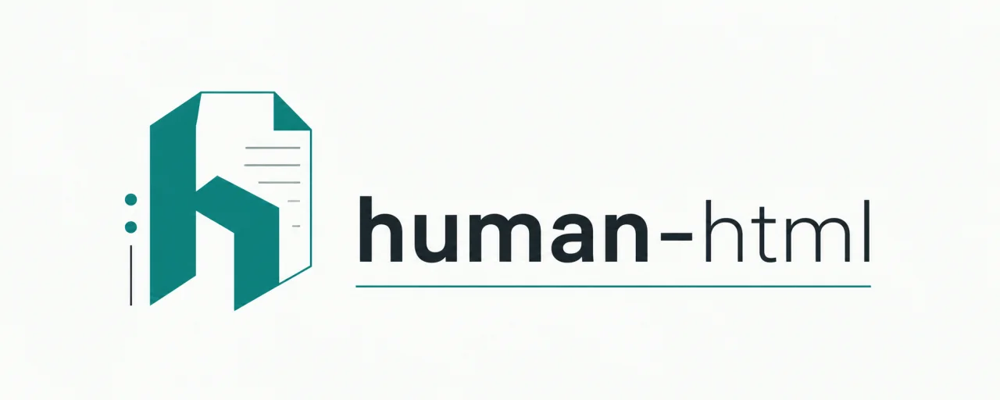

<p align="center">
  
</p>

# human-html

[](https://skills.sh/rhnfzl/human-html)
[](https://github.com/rhnfzl/human-html/releases)
[](LICENSE)

An Agent Skill for the documents an agent writes for a person, plans, reviews, postmortems, architecture explainers, decisions. Each one lands as a single self-contained HTML page instead of a Markdown wall, and an offline validator holds it to that shape.

```bash
npx skills add rhnfzl/human-html
```

That auto-detects your installed agents. Then ask for a plan, or a review, or a postmortem.

It is a standard [Agent Skill](https://agentskills.io), native in Claude Code, Codex, Cursor and ten others, and covered by the universal installers everywhere else.

## Every one of them opens the same way

That is the part worth having. You are not scrolling to find where the risks went, they are where they were last time, and so is the summary and so is the rollback. It pays off hardest on anything recurring: when this week's status report looks like last week's, the difference is what stands out.

Nine kinds, each with its own sections and a [worked example](https://rhnfzl.github.io/human-html/):

| Kind | The reader wants to |
|---|---|
| [plan](https://rhnfzl.github.io/human-html/skills/human-html/examples/plan-canonical.html) | execute: outcome, sequence, risks, rollback |
| [review](https://rhnfzl.github.io/human-html/skills/human-html/examples/review-canonical.html) | inspect a change: verdict first, concerns ranked |
| [architecture](https://rhnfzl.github.io/human-html/skills/human-html/examples/architecture-canonical.html) | understand a proposed change to system shape |
| [understanding](https://rhnfzl.github.io/human-html/skills/human-html/examples/understanding-canonical.html) | understand how something works today |
| [research](https://rhnfzl.github.io/human-html/skills/human-html/examples/research-canonical.html) | learn what the digging found |
| [decision](https://rhnfzl.github.io/human-html/skills/human-html/examples/decision-canonical.html) | decide: options, consequences, reversibility |
| [prototype](https://rhnfzl.github.io/human-html/skills/human-html/examples/prototype-canonical.html) | feel a proposed thing before it exists |
| [status](https://rhnfzl.github.io/human-html/skills/human-html/examples/status-canonical.html) | catch up: where we are, blockers, next |
| [incident](https://rhnfzl.github.io/human-html/skills/human-html/examples/incident-canonical.html) | learn from failure: timeline, root cause, actions |

## Except when the shape is the argument

A findings taxonomy, a four-way design exploration, a line-by-line map of a port. Each of those has a natural shape that carries part of what it is saying, and forcing it into `plan` sections makes the document worse. So the shape can be the agent's call instead:

```bash
python3 <skill-dir>/human_html_artifacts.py new review "Blindspot pass on RFC 214" --mode dynamic
```

One question decides which you want, does the reader benefit from this looking like the last one? Yes means use a kind, because comparability is the whole payoff. No means go dynamic. Unclear means use the kind, since a kind that fits slightly badly costs a reader less than an invented structure that fits nothing.

Structure is the agent's, style is not. [Dynamic mode](https://rhnfzl.github.io/human-html/) stands down three rules, all of them about which sections exist. Nothing aimed at the reader is relaxed: it still renders on a phone, still exists with JavaScript off, still answers first, still puts a real visual in every comparison.

## How it differs

- **The shape is a contract, not an intention.** Style guidance evaporates the moment an agent regenerates a file. `check` runs offline, blocks on three rules, warns on the rest, and every rule is suppressible per artifact.
- **The checks are markers, not proofs.** [`artifact-spine.md`](skills/human-html/references/artifact-spine.md) says what each one does and does not establish, next to the standard no validator can reach.
- **Local unless you say otherwise.** No telemetry, no phone-home, no postinstall scripts, no network calls in the core loop. Sharing is a menu: GitHub Pages, an optional bring-your-own-bucket S3 script, or any static host.
- **An agent can see its own output.** `render` screenshots through headless Chrome, and `render --no-js` shows what an iOS Quick Look or email preview sees. First time it ran, it found a broken static floor in this repo's own prototype example, hidden behind a rule that reported clean.

[`references/`](skills/human-html/references/) holds the patterns worth stealing on their own, whether or not you use the rest: a pre-merge self-check for a review attached to a PR (never scored, never a gate), open questions routed with an owner, a date, and where they land if nobody answers, non-goals, and a files-read list carrying the revision it was read at, so staleness is one `git diff` away.

The contract is stolen craft in the [Steal Like an Artist](https://austinkleon.com/steal/) sense: the inverted pyramid, postmortem timelines, C4 diagrams, first-use glossing. The examples exist to be stolen from too, and so does the repo. Fork it, re-theme it, suppress what you disagree with.

<details>
<summary>Setup, other install routes, agent support, what is inside</summary>

Python 3.11+ is all you need, tested on 3.11, 3.12 and 3.13.

Optional hooks, an advisory nudge and a gallery autoindex, both advisory-only and always exit 0:

```bash
python3 <skill-dir>/activate_hooks.py
```

That merges with existing settings for Claude Code, Codex, Cursor and Windsurf, and is safe to rerun. Replace `<skill-dir>` with the path your installer reports, commonly `~/.agents/skills/human-html`.

Other routes:

- `npx openskills install rhnfzl/human-html` for AGENTS.md ecosystems
- Claude Code natively: `/plugin marketplace add rhnfzl/human-html`, then `/plugin install human-html@rhnfzl`
- Manual: clone and symlink `skills/human-html/` into your agent's skills directory
- The CLI directly: `python3 <skill-dir>/human_html_artifacts.py new|check|index|render|embed-svg|deps`

Optional tools, each one adds something rather than gating anything. Run `deps` to see what is present.

| Tool | Enables |
|---|---|
| [`jq`](https://jqlang.github.io/jq/) | the two hooks, which no-op silently without it |
| [`mmdc`](https://github.com/mermaid-js/mermaid-cli) | Mermaid rendered to inline SVG, for a fully offline artifact |
| [`excalidraw-mcp`](https://github.com/excalidraw/excalidraw-mcp) | hand-drawn diagrams |

Mermaid otherwise loads a CDN at view time, so use `embed-svg` for artifacts that must work offline.

A standard [Agent Skill](https://agentskills.io), so it works anywhere that reads the format. Native, meaning `SKILL.md` auto-loads with no installer: Claude Code, Codex, Cursor, GitHub Copilot, Gemini CLI, OpenCode, Zed, Amp, Warp, Kiro, Crush, Qwen Code, Pi. Everything else is covered by the universal installers, which target 70+ agents including Windsurf, Cline and Aider.

Inside: `SKILL.md` is the contract, `examples/` holds twelve warning-free artifacts (nine kinds plus three dynamic ones that share no structure on purpose), `references/` holds the spine, the patterns, the diagram decision tree and workflow integrations, and `tests/` holds 42 stdlib `unittest` tests (`python3 -m unittest discover -s tests`).

As with any skill, read `skills/human-html/SKILL.md` before installing.

</details>

## License

[MIT](LICENSE)
